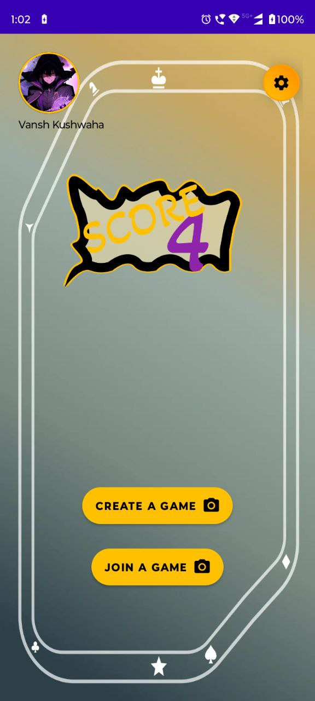
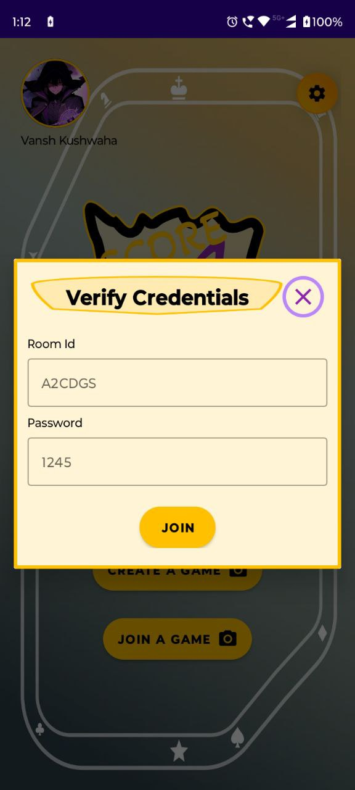
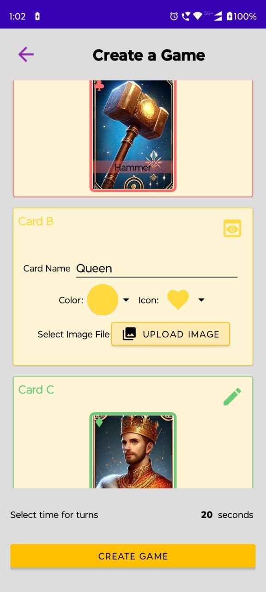
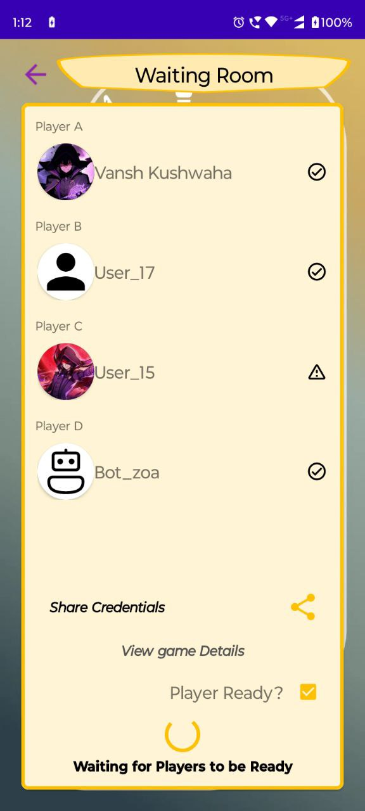
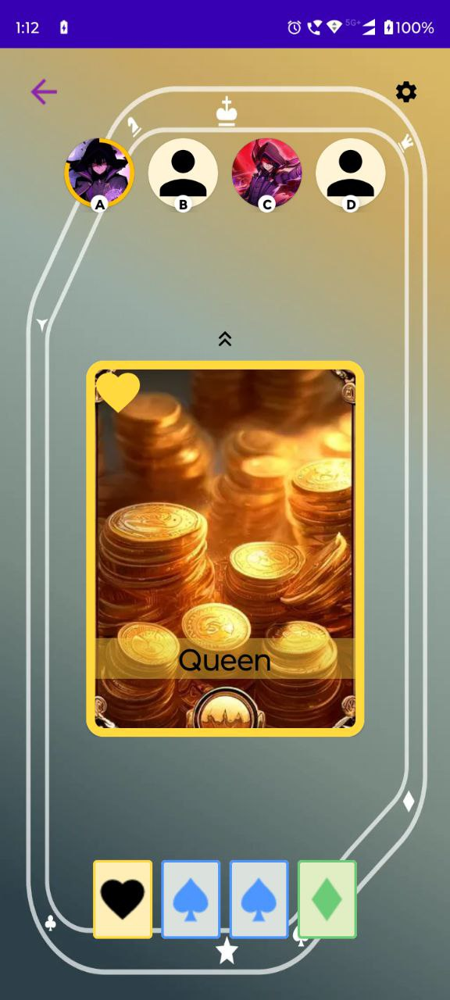
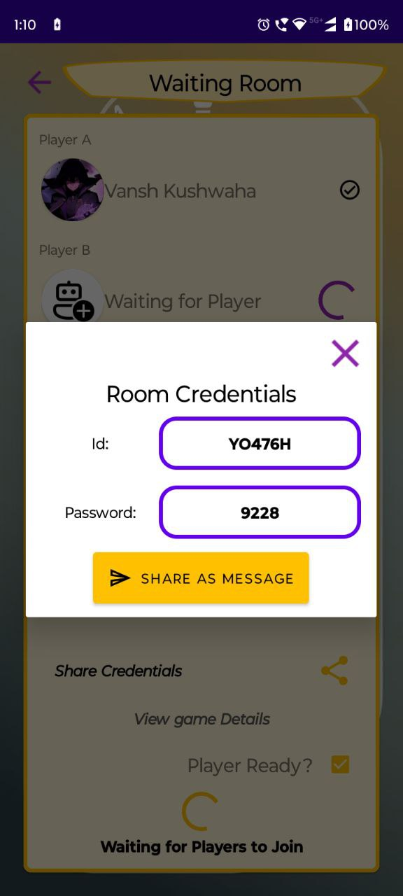

# Score Four - A Fast-Paced Multiplayer Card Game

**Score Four** is a multiplayer card game where players compete to collect a set of four matching cards before their opponents. The game is built with real-time interactivity, authentication, and cloud-based storage to enhance the user experience.

## 🚀 Features

- **🃏 Random Card Shuffling:** Each game session shuffles 16 cards randomly among 4 players.
- **🔄 Real-Time Card Passing:** Players exchange cards with one another in real time to complete a set of 4.
- **🏆 Winning Condition:** The first player to collect a set of 4 matching cards wins the game.
- **🔒 Firebase Authentication:** Secure user login and authentication for seamless game access.
- **📡 Firestore & Realtime Database:** Ensures smooth real-time updates and game synchronization.
- **📸 Image Uploading:** Players can upload custom card images and profile pictures using Firebase Storage.
- **🎨 User-Customizable Cards:** Each user can upload their own card designs for different game variations.

## 🛠️ Tech Stack

- **Language:** Kotlin (Android)
- **Database:** Firebase Firestore & Realtime Database
- **Authentication:** Firebase Authentication
- **Storage:** Firebase Storage for profile pictures and custom card images
- **State Management:** ViewModel & LiveData (MVVM Architecture)
- **Networking:** Firebase SDK for real-time communication
- **UI Framework:** Jetpack Compose / XML
- **Version Control:** Git & GitHub

## 📷 Screenshots

  
  
  

  
  
  

